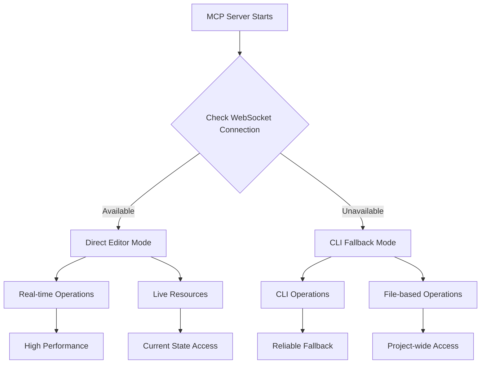

# Godot MCP Nxt

[](https://godotengine.org)
[](https://nodejs.org/en/download/)
[](https://www.typescriptlang.org/)
[](https://github.com/jlowin/fastmcp)

A unified Model Context Protocol (MCP) server for Godot Engine that combines the best of both worlds: direct editor integration and external CLI operations.

## Overview

This unified MCP server provides comprehensive Godot development assistance by intelligently choosing between two operation modes:

### 🖥️ **Direct Editor Mode** (Preferred)
When the Godot editor with the MCP addon is running, the server connects directly via WebSocket for real-time, high-performance operations including:
- Live scene manipulation
- Direct script editing
- Real-time project state access
- Instant feedback and validation

### 🛠️ **CLI Fallback Mode**
When direct connection isn't available, the server uses Godot's command-line interface with bundled GDScript operations for:
- Project launching and debugging
- Scene creation and modification
- Asset management
- UID handling for Godot 4.4+

## Features

### Core Functionality
- **🔧 Project Management**: Launch editor, run/debug projects, get project info
- **🎭 Scene Operations**: Create scenes, add/modify nodes, load textures
- **📝 Script Handling**: Read/write scripts, analyze code
- **🎨 Asset Management**: Export MeshLibraries, handle UIDs
- **📊 Live Resources**: Access current scene, scripts, and editor state (when connected)

### Smart Mode Detection
- Automatically detects and uses WebSocket connection when available
- Seamlessly falls back to CLI operations
- No configuration required - works out of the box

## Installation

### Prerequisites
- [Godot Engine](https://godotengine.org/download) (any recent version)
- Node.js 18+ and npm

### Quick Setup

1. **Clone and Install**
   ```bash
   git clone <https://github.com/SK-DEV-AI/godot-mcp-nxt.git>
   cd unified-godot-mcp
   npm install
   npm run build
   ```

2. **Configure Your AI Assistant**

   **For Claude Desktop:**
   ```json
   {
     "mcpServers": {
       "godot-unified": {
         "command": "node",
         "args": ["/path/to/unified-godot-mcp/server/dist/index.js"],
         "env": {
           "DEBUG": "true"
         }
       }
     }
   }
   ```

   **For Cursor:**
   Add to `.cursor/mcp.json`:
   ```json
   {
     "mcpServers": {
       "godot-unified": {
         "command": "node",
         "args": ["/path/to/unified-godot-mcp/server/dist/index.js"]
       }
     }
   }
   ```

3. **Optional: Enable Direct Editor Mode**
   - Copy the `addons/godot_mcp` folder to your Godot project's addons directory
   - Enable the "Godot MCP" plugin in Project Settings
   - The server will automatically detect and use direct connections

## Usage Examples

### Basic Project Operations
```
"Launch the Godot editor for my project at /path/to/project"
"Run my Godot project and show me any errors"
"Get information about my Godot project structure"
```

### Scene and Node Management
```
"Create a new scene with a Player node"
"Add a Sprite2D node to my player scene and load the character texture"
"Create a main menu with buttons and labels"
```

### Advanced Operations
```
"Export my 3D models as a MeshLibrary for use with GridMap"
"Get the UID for a specific script file in my Godot 4.4 project"
"Update UID references in my Godot project after upgrading"
```

## Architecture

### Dual-Mode Operation Flow



### Key Components

- **FastMCP Framework**: Modern, type-safe MCP implementation
- **WebSocket Bridge**: Direct communication with Godot editor
- **CLI Executor**: Godot command-line interface wrapper
- **Bundled Operations**: Comprehensive GDScript operation library
- **Smart Fallback**: Automatic mode selection

## Configuration

### Environment Variables
- `GODOT_PATH`: Override automatic Godot executable detection
- `DEBUG`: Enable detailed logging (`true`/`false`)

### Connection Settings
- **WebSocket Port**: Automatically detected (default: 3000)
- **CLI Timeout**: Configurable operation timeouts
- **Path Validation**: Strict or lenient project path checking

## Troubleshooting

### Connection Issues
- **WebSocket Not Connecting**: Ensure Godot addon is enabled and running
- **CLI Operations Failing**: Check `GODOT_PATH` environment variable
- **Permission Errors**: Ensure write access to project directories

### Performance Considerations
- **Direct Mode**: Best for interactive development
- **CLI Mode**: Better for batch operations and CI/CD
- **Resource Limits**: Monitor memory usage with large projects

## Development

### Building
```bash
npm run build
```

### Testing
```bash
npm test
```

### Project Structure
```
unified-godot-mcp/
├── server/                 # FastMCP server implementation
│   ├── src/
│   │   ├── index.ts       # Main server entry point
│   │   ├── tools/         # Tool implementations
│   │   ├── resources/     # Resource providers
│   │   └── utils/         # Utility functions
├── addons/                # Godot editor addon
│   └── godot_mcp/         # WebSocket server plugin
├── docs/                  # Documentation
└── scripts/               # CLI operation scripts
```

## Contributing

Contributions welcome! Please see the contributing guidelines and ensure all tests pass.

## License

MIT License - see LICENSE file for details.

## Acknowledgments

This unified server combines the best features from:
- [godot-mcp](https://github.com/Coding-Solo/godot-mcp.git) (CLI operations)
- [Godot-MCP](https://github.com/ee0pdt/Godot-MCP.git) (Direct editor integration)

Special thanks to the FastMCP framework and the Godot community.
