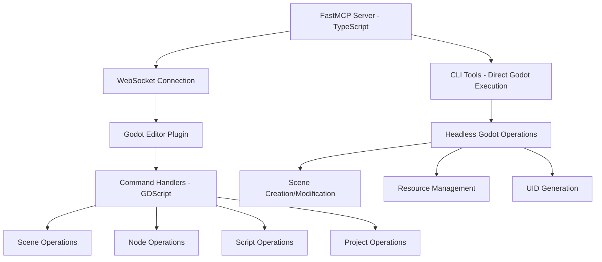

# Godot MCP Server Improvements - Implementation Plan

## Architecture Overview

## High Priority Improvements

### 1. Resource Templates for Dynamic Project Resources

**Current State:** Static resources that return fixed data
**Goal:** Dynamic resource templates that allow accessing specific project elements

**Implementation Steps:**
- Create resource template for individual scene structures: `godot/scene/{scene_path}`
- Create resource template for script content: `godot/script/{script_path}`
- Create resource template for project file listings: `godot/project/files/{type}`
- Update existing static resources to use templates where appropriate
- Add proper error handling for invalid paths

**Files to Modify:**
- `server/src/resources/scene_resources.ts`
- `server/src/resources/script_resources.ts`
- `server/src/resources/project_resources.ts`

### 2. Progress Reporting for Long Operations

**Current State:** Synchronous operations with no progress feedback
**Goal:** Real-time progress updates for long-running operations

**Implementation Steps:**
- Add `streamingHint: true` to relevant tools
- Implement `reportProgress` calls in long operations (scene creation, UID updates, etc.)
- Add `streamContent` for incremental text updates
- Update CLI tools to support progress callbacks
- Add progress reporting to WebSocket command handlers

**Files to Modify:**
- `server/src/tools/cli_tools.ts`
- `server/src/utils/godot_connection.ts`
- `addons/godot_mcp/commands/*.gd`

### 3. Connection Limits and Queuing for WebSocket Server

**Current State:** Unlimited concurrent connections
**Goal:** Configurable connection limits with queuing

**Implementation Steps:**
- Add connection limit configuration to WebSocket server
- Implement connection queue for when limits are reached
- Add connection timeout and cleanup logic
- Update client management to handle queued connections
- Add metrics for connection monitoring

**Files to Modify:**
- `addons/godot_mcp/mcp_server.gd`
- Add configuration options

### 4. Code Analysis Tool with Embedded Resources

**Current State:** No code analysis capabilities
**Goal:** Syntax highlighting, error detection, and code insights

**Implementation Steps:**
- Create new `analyze_code` tool in FastMCP
- Implement GDScript syntax analysis
- Add error detection and suggestions
- Return results with embedded resources for code snippets
- Support multiple file analysis
- Add performance metrics

**Files to Create:**
- `server/src/tools/code_analysis_tools.ts`
- Supporting utilities

## Medium Priority Improvements

### 5. Caching Layer for CLI Operations

**Current State:** No caching, repeated operations are slow
**Goal:** Cache frequently accessed data and operation results

**Implementation Steps:**
- Add caching layer to CLI tools
- Cache Godot path detection
- Cache project structure information
- Implement cache invalidation strategies
- Add cache configuration options

### 6. Retry Logic and Better Error Recovery

**Current State:** Basic retry in connection, limited error recovery
**Goal:** Comprehensive retry and error handling

**Implementation Steps:**
- Add exponential backoff retry logic
- Implement circuit breaker pattern for failing operations
- Add detailed error classification
- Improve error messages and recovery suggestions
- Add operation timeout configuration

### 7. Performance Profiling Tools

**Current State:** No performance monitoring
**Goal:** Scene and script performance analysis

**Implementation Steps:**
- Create performance profiling tools
- Add scene complexity analysis
- Implement script execution time monitoring
- Add resource usage tracking
- Create performance reports with embedded resources

## Low Priority Improvements

### 8. Compression and Rate Limiting

**Current State:** No compression or rate limiting
**Goal:** Optimized data transfer and security

**Implementation Steps:**
- Add payload compression for WebSocket messages
- Implement rate limiting for API calls
- Add message size limits
- Optimize data serialization

### 9. Plugin Architecture

**Current State:** Monolithic command processors
**Goal:** Extensible plugin system

**Implementation Steps:**
- Design plugin interface
- Refactor command processors to use plugins
- Add plugin loading and management
- Create plugin API documentation

### 10. Asset Optimization Tools

**Current State:** No asset optimization
**Goal:** Texture and resource optimization

**Implementation Steps:**
- Add texture compression tools
- Implement resource deduplication
- Add asset size analysis
- Create optimization recommendations

## Implementation Order

1. **Phase 1: Resource Templates** (High Priority)
   - Immediate value for dynamic resource access
   - Foundation for other improvements

2. **Phase 2: Progress Reporting** (High Priority)
   - Better user experience for long operations
   - Requires FastMCP streaming features

3. **Phase 3: Connection Management** (High Priority)
   - Prevents server overload
   - Improves stability

4. **Phase 4: Code Analysis** (High Priority)
   - Adds valuable development tools
   - Leverages embedded resources

5. **Phase 5: Caching & Retry Logic** (Medium Priority)
   - Performance improvements
   - Better reliability

6. **Phase 6: Profiling Tools** (Medium Priority)
   - Performance monitoring capabilities

7. **Phase 7: Advanced Features** (Low Priority)
   - Compression, plugins, asset optimization

## Success Criteria

- All high priority features implemented and tested
- Performance improvements measurable
- Error handling comprehensive
- Documentation updated
- Backward compatibility maintained