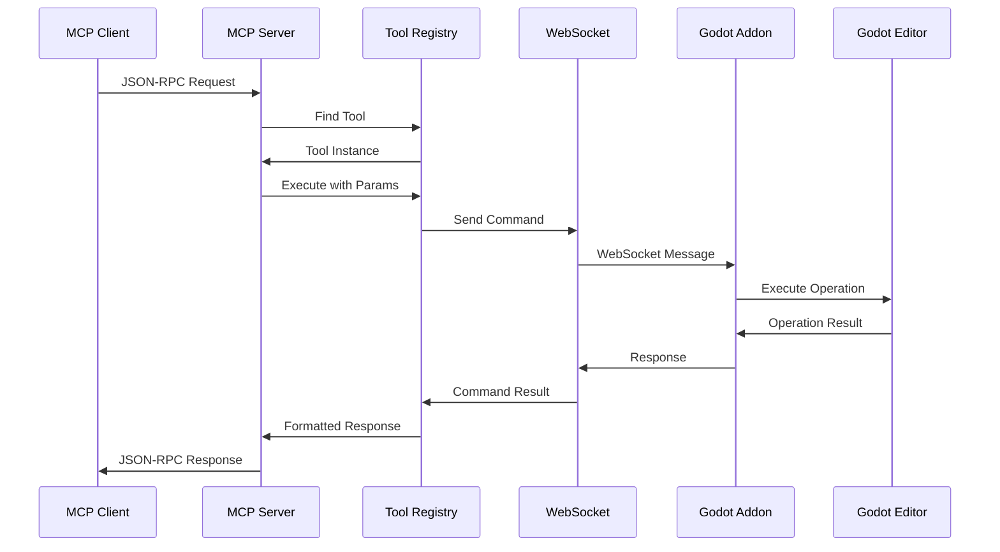
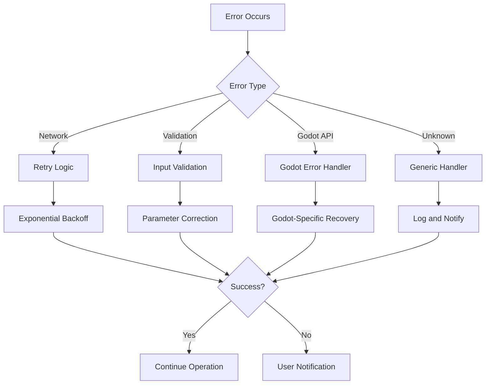

# Architecture Guide

This document provides a comprehensive overview of the Godot MCP Server architecture, explaining the design principles, component interactions, and implementation details.

## Table of Contents

- [System Overview](#system-overview)
- [Core Components](#core-components)
- [Data Flow](#data-flow)
- [Communication Protocols](#communication-protocols)
- [Performance Considerations](#performance-considerations)
- [Security Architecture](#security-architecture)
- [Extensibility](#extensibility)
- [Deployment Patterns](#deployment-patterns)

## System Overview

The Godot MCP Server is a distributed system that integrates AI-powered development tools with the Godot game engine through the Model Context Protocol (MCP). The architecture follows a client-server model with multiple integration points.

### High-Level Architecture

```
┌─────────────────────────────────────────────────────────────┐
│                    Godot MCP Ecosystem                      │
├─────────────────────────────────────────────────────────────┤
│  ┌─────────────────┐    ┌─────────────────┐    ┌─────────┐  │
│  │   MCP Clients   │    │   MCP Server    │    │  Godot  │  │
│  │                 │    │   (Node.js)     │    │  Editor │  │
│  │ • Claude Code   │◄──►│ • FastMCP       │◄──►│ • Addon  │  │
│  │ • VS Code       │    │ • Tool Registry │    │ • UI     │  │
│  │ • Cursor        │    │ • WebSocket     │    │ • API    │  │
│  │ • Custom Apps   │    │ • Performance   │    │          │  │
│  └─────────────────┘    └─────────────────┘    └─────────┘  │
└─────────────────────────────────────────────────────────────┘
                              │
                              ▼
                   ┌─────────────────────┐
                   │  Shared Components  │
                   │                     │
                   │ • Error Recovery    │
                   │ • Performance Mon.  │
                   │ • Dynamic Prompts   │
                   │ • Fuzzy Matching    │
                   └─────────────────────┘
```

## Core Components

### 1. MCP Server (TypeScript/Node.js)

The MCP server is the central intelligence hub that coordinates all operations.

#### Key Components:

**FastMCP Framework Integration**
```typescript
// server/src/index.ts
import { FastMCP } from 'fastmcp';

const server = new FastMCP({
  name: 'GodotMCP',
  version: '1.0.0',
});
```

**Tool Registry System**
```typescript
// server/src/utils/tool_registry.ts
export class ToolRegistry {
  private tools: Map<string, MCPTool> = new Map();
  private categories: Map<string, string[]> = new Map();

  registerTool(tool: MCPTool, category: string): void {
    this.tools.set(tool.name, tool);
    if (!this.categories.has(category)) {
      this.categories.set(category, []);
    }
    this.categories.get(category)!.push(tool.name);
  }
}
```

**WebSocket Communication Layer**
```typescript
// server/src/utils/godot_connection.ts
export class GodotConnection {
  private ws: WebSocket | null = null;
  private commandQueue: Map<string, CommandPromise> = new Map();

  async sendCommand<T>(type: string, params: any): Promise<T> {
    // Implementation handles queuing, timeouts, retries
  }
}
```

### 2. Godot Addon (GDScript)

The Godot addon provides seamless integration with the Godot editor.

#### Key Components:

**MCP Server Integration**
```gdscript
# addons/godot_mcp/mcp_server.gd
@tool
extends EditorPlugin

var tcp_server := TCPServer.new()
var port := 9080

func _enter_tree():
  # Initialize WebSocket server
  var err = tcp_server.listen(port)
  if err == OK:
    print("Listening on port", port)
    set_process(true)
```

**Command Processing System**
```gdscript
# addons/godot_mcp/command_handler.gd
class_name MCPCommandHandler
extends Node

var _command_processors = []

func _initialize_command_processors():
  # Register all command processors
  var node_commands = MCPNodeCommands.new()
  var script_commands = MCPScriptCommands.new()
  var scene_commands = MCPSceneCommands.new()
  # ... more processors
```

**UI Integration**
```gdscript
# addons/godot_mcp/ui/mcp_panel.gd
@tool
extends Panel

func _ready():
  # Initialize UI components
  _setup_performance_monitor()
  _setup_error_display()
  _connect_signals()
```

### 3. Shared Utility Libraries

#### Enhanced Error Handler
```typescript
// server/src/utils/enhanced_error_handler.ts
export class EnhancedErrorHandler {
  private errorPatterns: Map<string, ErrorPattern> = new Map();
  private recoveryStrategies: Map<string, RecoveryStrategy[]> = new Map();

  async analyzeError(error: ErrorContext): Promise<ErrorAnalysis> {
    // Pattern matching and root cause analysis
  }
}
```

#### Dynamic Prompt Manager
```typescript
// server/src/utils/dynamic_prompt_manager.ts
export class DynamicPromptManager {
  private promptTemplates: Map<string, PromptTemplate> = new Map();
  private contextCache: Map<string, ContextData> = new Map();

  async injectPrompts(basePrompt: string, context: PromptContext): Promise<string> {
    // Context-aware prompt enhancement
  }
}
```

## Data Flow

### Request-Response Flow

```
1. MCP Client Request
       ↓
2. MCP Server (FastMCP)
       ↓
3. Tool Execution
       ↓
4. Godot Command (WebSocket)
       ↓
5. Godot Addon Processing
       ↓
6. Editor Operation
       ↓
7. Result Collection
       ↓
8. Response to MCP Client
```

### Detailed Flow Example



### Error Handling Flow



## Communication Protocols

### MCP Protocol Implementation

The system implements the Model Context Protocol specification:

```typescript
// JSON-RPC 2.0 over stdio/WebSocket
interface MCPMessage {
  jsonrpc: "2.0";
  id?: string | number;
  method?: string;
  params?: any;
  result?: any;
  error?: MCPError;
}

interface MCPError {
  code: number;
  message: string;
  data?: any;
}
```

### WebSocket Protocol

Custom protocol for Godot communication:

```typescript
// Command message format
interface GodotCommand {
  type: string;
  params: Record<string, any>;
  commandId: string;
}

// Response message format
interface GodotResponse {
  status: 'success' | 'error';
  result?: any;
  message?: string;
  commandId?: string;
}
```

### Tool Registration Protocol

```typescript
interface MCPTool {
  name: string;
  description: string;
  parameters: z.ZodType<any>;
  execute: (args: any) => Promise<any>;
  annotations?: {
    streamingHint?: boolean;
    readOnlyHint?: boolean;
    openWorldHint?: boolean;
  };
}
```

## Performance Considerations

### Optimization Strategies

#### 1. Connection Pooling
```typescript
// server/src/utils/godot_connection.ts
export class ConnectionPool {
  private connections: Map<string, GodotConnection> = new Map();
  private maxConnections = 10;

  getConnection(projectPath: string): GodotConnection {
    if (!this.connections.has(projectPath)) {
      const connection = new GodotConnection();
      this.connections.set(projectPath, connection);
    }
    return this.connections.get(projectPath)!;
  }
}
```

#### 2. Caching Layer
```typescript
// server/src/utils/cache.ts
export class CacheManager {
  private cache = new Map<string, CacheEntry>();
  private maxSize = 1000;
  private ttl = 300000; // 5 minutes

  async get<T>(key: string): Promise<T | null> {
    const entry = this.cache.get(key);
    if (!entry || this.isExpired(entry)) {
      return null;
    }
    return entry.data as T;
  }
}
```

#### 3. Lazy Loading
```typescript
// server/src/utils/lazy_loader.ts
export class LazyLoader<T> {
  private instance: T | null = null;
  private factory: () => Promise<T>;

  constructor(factory: () => Promise<T>) {
    this.factory = factory;
  }

  async get(): Promise<T> {
    if (!this.instance) {
      this.instance = await this.factory();
    }
    return this.instance;
  }
}
```

### Performance Metrics

The system tracks various performance indicators:

- **Response Time**: MCP request → response latency
- **Throughput**: Operations per second
- **Memory Usage**: Server and Godot process memory
- **Connection Health**: WebSocket connection stability
- **Error Rate**: Failed operations percentage

## Security Architecture

### Threat Model

The system addresses these security considerations:

1. **Local Development Focus**: Designed for local development environments
2. **Network Isolation**: WebSocket communication limited to localhost
3. **Input Validation**: Comprehensive parameter validation using Zod
4. **Resource Limits**: Connection and memory usage limits
5. **Error Handling**: Secure error messages without information leakage

### Security Controls

```typescript
// Input validation
const validatedParams = z.object({
  node_path: z.string().max(500).regex(/^[^\\]*$/),
  node_type: z.enum(['Node2D', 'Sprite2D', 'CharacterBody2D']),
}).parse(params);

// Rate limiting
const rateLimiter = new RateLimiter({
  windowMs: 60000, // 1 minute
  max: 100, // 100 requests per minute
  message: 'Too many requests'
});
```

## Extensibility

### Plugin Architecture

The system supports extensibility through multiple mechanisms:

#### 1. Tool Registration
```typescript
// Add custom tools
const customTool: MCPTool = {
  name: 'my_custom_tool',
  description: 'Custom functionality',
  parameters: z.object({ param: z.string() }),
  execute: async (args) => { /* implementation */ }
};

globalToolRegistry.registerTool(customTool, 'custom');
```

#### 2. Command Processor Extension
```gdscript
# addons/godot_mcp/commands/custom_commands.gd
class_name MCPCustomCommands
extends MCPBaseCommandProcessor

func process_command(client_id: int, command_type: String, params: Dictionary, command_id: String) -> bool:
  match command_type:
    "custom_operation":
      _handle_custom_operation(client_id, params, command_id)
      return true
  return false
```

#### 3. Resource Template Extension
```typescript
// server/src/resources/custom_resources.ts
export const customResourceTemplate: ResourceTemplate = {
  uriTemplate: 'custom://{type}/{id}',
  name: 'Custom Resource',
  description: 'Custom resource type',
  mimeType: 'application/json'
};
```

### Configuration Extension

```typescript
// Custom configuration
interface CustomConfig {
  customTools: string[];
  customResources: string[];
  customProcessors: string[];
}

const config: CustomConfig = {
  customTools: ['tool1', 'tool2'],
  customResources: ['resource1'],
  customProcessors: ['processor1']
};
```

## Deployment Patterns

### Development Environment

```bash
# Local development setup
npm run dev          # Auto-reload development server
npm run build        # Production build
npm test            # Run test suite
npm run lint        # Code quality checks
```

### Production Deployment

```dockerfile
# Dockerfile for production
FROM node:18-alpine

WORKDIR /app
COPY package*.json ./
RUN npm ci --only=production

COPY server/dist ./dist
EXPOSE 9080

CMD ["node", "dist/index.js"]
```

### Docker Compose Setup

```yaml
# docker-compose.yml
version: '3.8'
services:
  godot-mcp:
    build: .
    ports:
      - "9080:9080"
    environment:
      - MCP_PORT=9080
      - MCP_DEBUG=false
    volumes:
      - ./logs:/app/logs
    restart: unless-stopped
```

### Kubernetes Deployment

```yaml
# kubernetes/deployment.yaml
apiVersion: apps/v1
kind: Deployment
metadata:
  name: godot-mcp
spec:
  replicas: 2
  selector:
    matchLabels:
      app: godot-mcp
  template:
    metadata:
      labels:
        app: godot-mcp
    spec:
      containers:
      - name: godot-mcp
        image: godot-mcp:latest
        ports:
        - containerPort: 9080
        env:
        - name: MCP_PORT
          value: "9080"
        resources:
          requests:
            memory: "256Mi"
            cpu: "100m"
          limits:
            memory: "512Mi"
            cpu: "500m"
```

## Monitoring and Observability

### Logging Architecture

```typescript
// server/src/utils/logger.ts
export class Logger {
  private logLevel: LogLevel = 'info';
  private transports: LogTransport[] = [];

  log(level: LogLevel, message: string, meta?: any): void {
    const entry: LogEntry = {
      timestamp: new Date(),
      level,
      message,
      meta
    };

    this.transports.forEach(transport => {
      transport.log(entry);
    });
  }
}
```

### Metrics Collection

```typescript
// server/src/utils/metrics.ts
export class MetricsCollector {
  private metrics: Map<string, Metric> = new Map();

  recordMetric(name: string, value: number, tags?: Record<string, string>): void {
    const metric: Metric = {
      name,
      value,
      timestamp: Date.now(),
      tags: tags || {}
    };

    // Store metric for analysis
    this.storeMetric(metric);

    // Send to monitoring system
    this.sendToMonitor(metric);
  }
}
```

### Health Checks

```typescript
// server/src/utils/health.ts
export class HealthChecker {
  async checkHealth(): Promise<HealthStatus> {
    const checks = await Promise.all([
      this.checkDatabase(),
      this.checkWebSocket(),
      this.checkGodotConnection(),
      this.checkMemoryUsage()
    ]);

    return {
      status: checks.every(check => check.healthy) ? 'healthy' : 'unhealthy',
      checks,
      timestamp: new Date()
    };
  }
}
```

## Conclusion

The Godot MCP Server architecture provides a robust, extensible, and performant foundation for AI-powered Godot development. The modular design allows for easy customization and extension while maintaining high performance and reliability.

Key architectural strengths:

- **Separation of Concerns**: Clear boundaries between MCP server, Godot addon, and client applications
- **Extensibility**: Plugin architecture for adding custom tools and processors
- **Performance**: Optimized communication protocols and caching mechanisms
- **Reliability**: Comprehensive error handling and recovery mechanisms
- **Security**: Appropriate security measures for local development environments

This architecture enables developers to leverage AI assistance seamlessly within their Godot development workflow, providing intelligent suggestions, automated error recovery, and performance optimization guidance.